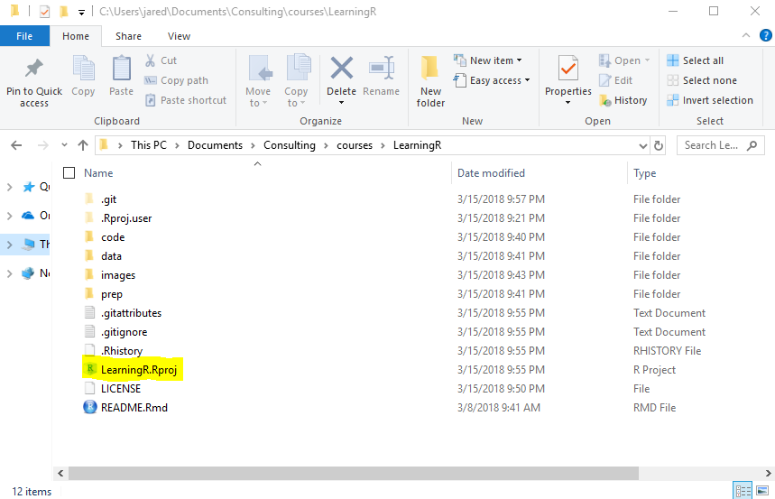

<!-- README.md is generated from README.Rmd. Please edit that file -->

# Live Training

This is an empty repo to initialize an R project for training courses
organized by [ODSC
Europe](https://odsc.com/london/europe-2018-schedule).

Please follow all instructions to set up your environment for the
training.

# Packages

To get started run the following code to install the latest version of
the necessary packages.

<div class="sourceCode">

<pre class='sourceCode r'><code class='sourceCode r'>
packages <- c(
    'caret', 
    'coefplot', 
    'DBI', 
    'dbplyr', 
    'devtools', 
    'doParallel', 
    'DT', 
    'dygraphs', 
    'ggthemes', 
    'ggthemes', 
    'glmnet', 
    'here', 
    'jsonlite', 
    'jsonlite', 
    'knitr', 
    'leaflet', 
    'plotly', 
    'recipes', 
    'reshape2', 
    'rmarkdown', 
    'RSQLite', 
    'rvest', 
    'shiny', 
    'shinyjs', 
    'shinythemes', 
    'tidyverse', 
    'useful', 
    'usethis', 
    'UsingR', 
    'xgboost'
)
install.packages(packages)
</code></pre>

</div>

# Project Structure

Making use of RStudio projects greatly improves the user experience. To
facilitate this users should run the following code which will recreate
this project on their computer. Be sure to select the positive prompts
such as `yes`, `yeah`,
etc.

``` r
newProject <- usethis::use_course('https://github.com/jaredlander/odsclondon2018/archive/master.zip')
```

<!-- After that runs successfully you will have a new folder holding the R project that looks like this (the name in the image may be different). -->

<!-- ```{r proj-folder,echo=FALSE,out.width='50%'} -->

<!--  -->

<!-- ``` -->

After running this code you will be in an RStudio Project called
odsclondon2018. You can see this in the top right of RStudio (the name
in the image may be different).

<!-- -->

# Data

Data for the class is kept at
[data.world](https://data.world/landeranalytics/training). Run the
following code to download all the data. This requires that you are
using an [RStudio
Project](https://support.rstudio.com/hc/en-us/articles/200526207-Using-Projects)
setup exactly like this repo, which is done if you followed the
preceding code.

``` r
source('prep/DownloadData.r')
```
